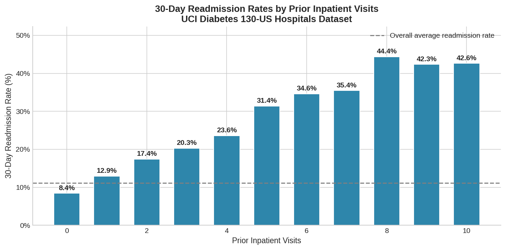

# Intervention Before You Leave - New Readmission Risk Tool Protects Patients

## Hook

1 in 5 diabetic patients is readmitted to the hospital in under a month, but most of those returns are preventable. A new tool makes the knowledge needed for intervention available at the first discharge.

## Problem Statement

The readmission of diabetic patients poses a persistent and costly challenge to hospitals across the US. The 30-day readmissions are bad for patients, but also the hospital becuase they trigger financial penalties under the fender Hospital Readmissions Reduction Program. The issue is lack of information. The care teams do not have a relaiable, data-driven method to identify which patients are at high risk of readmission before they discharge them.

## Solution Description

By analyzing information collected during a patient's hospital stay, the system can produce a clear prediction at the time of discharge if the patient would be readmitted. Patients with a prediction of being readmitted can be automatically routed to a care coordinator for a targeted follow-up plan. All the information that the system needs is already collected during a hospital stay, such as diagnosis codes, lab results, medications, length of stay, and prior visit history. The system specifically identified the number of prior visits as the most important predictive factor. The goal of this system is to identify patients who need more support before they are discharged when the support can actually be given.

## Chart

